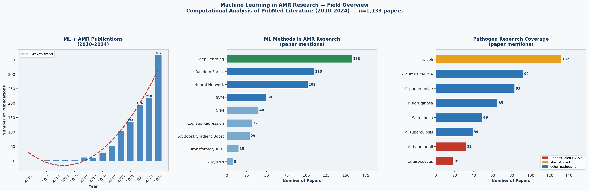
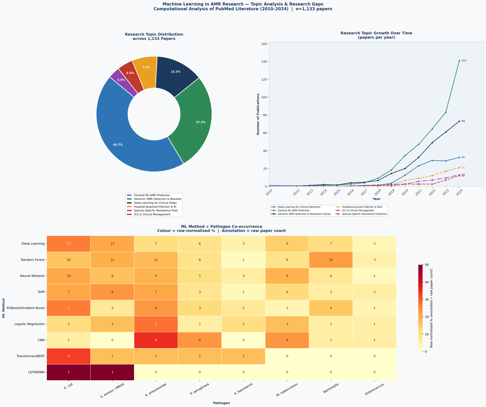

# ML in AMR Research — A PubMed Literature Analysis

**A computational analysis of how machine learning is being applied 
to antimicrobial resistance research (AMR), based on 1,133 PubMed papers 
published between 2010 and 2024.**

---

## Overview

This project uses the NCBI PubMed API to systematically map the 
landscape of machine learning research in antimicrobial resistance. 
Rather than building a model, this analysis asks a larger question: 
*Where is the field going, and where are the gaps?*

The pipeline fetches real paper metadata, cleans, and processes 
abstracts using NLP, applies LDA topic modelling to discover research 
clusters, and identifies which ML methods are being applied to which 
pathogens — and which combinations remain unexplored.

---

## Key Findings

### 1. Exponential Growth
ML-AMR publications grew from near zero in 2010 to 367 papers 
in 2024 alone — more than the entire period 2010–2018 combined. 
The field accelerated sharply after 2018, coinciding with the 
rise of accessible deep learning frameworks and large-scale 
genomic databases.

### 2. Deep Learning Dominates, But Unevenly-
Deep Learning leads at 13.9% of papers, but classical methods 
(Random Forest, Neural Networks, SVM) remain widely used, 
suggesting the field values interpretability. Transformer 
architectures despite transforming protein structure prediction 
via AlphaFold appear in only 15 papers (1.3%). This is a 
clear methodological gap.

### 3. Pathogen Coverage is Skewed
E. coli dominates at 11.7% of papers, largely due to its role 
as a model organism. In contrast, *A. baumannii* — a WHO 
Priority 1 Critical pathogen — appears in only 32 papers (2.8%). 
Enterococcus, despite rising vancomycin resistance globally, 
appears in just 18 papers (1.6%).

### 4. ML × Pathogen Gaps (Heatmap Analysis)
The co-occurrence heatmap reveals four critical gaps:
- **LSTM/RNN** - near absent across all ESKAPE pathogens, despite 
  being well-suited to genomic sequence data
- **Transformer/BERT** - zero papers for M. tuberculosis, 
  Salmonella and Enterococcus
- **CNN** - concentrated almost exclusively on K. pneumoniae; 
  not explored for other ESKAPE members
- **A. baumannii** - lowest ML coverage across every method, 
  despite being the most treatment-resistant ESKAPE pathogen 
  clinically

### 5. Research is Still Exploratory
44.7% of papers fall under General ML-AMR Prediction, broad 
applications without deep specialisation. The ICU & Clinical 
Management cluster represents only 3.3% of papers, despite ICUs 
being the highest-risk environment for AMR-related mortality.

---

## Figures

### Figure 1 — Field Overview

### Figure 2 — Topic Analysis & Research Gaps

---

## Pipeline

| Step | Description |
|------|-------------|
| Data collection | PubMed API (NCBI E-utilities)|
| Corpus | 1,133 papers after relevance filtering |
| NLP cleaning | Custom stopword removal, tokenisation (NLTK) |
| Topic modelling | LDA with 6 topics (scikit-learn) |
| ML detection | Regex-based method and pathogen tagging |
| Visualisation | matplotlib, seaborn |

---

## Limitations

- PubMed query captures keywords only - some ML papers may 
  be missed if methods aren't named explicitly
- LDA topic assignments are probabilistic
- English-language publications only - may underrepresent 
  research from non-English centres
- 2024 data may be incomplete due to indexing lag

---

## Repository Contents

| File | Description |
|------|-------------|
| `AMR_ML_Literature_Analysis.ipynb` | Full analysis notebook |
| `AMR_ML_Figure1_Overview.png` | Publication growth, ML methods, pathogen coverage |
| `AMR_ML_Figure2_Analysis.png` | Topic distribution, growth over time, ML × pathogen heatmap |

---

## Data Source

All paper metadata fetched live from 
[PubMed](https://pubmed.ncbi.nlm.nih.gov/) via the free 
NCBI E-utilities API. No copyrighted content is stored — 
only titles, abstracts, and publication years.

---

## Author

**Karthik Uday**  
M.Sc. Biotechnology — AI & Biomedical Data Analysis  
Vellore Institute of Technology, India
